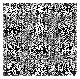

# qr-code-lambda
An AWS Lambda that generates a QR code for a URL.  This code uses the [ZXing](https://github.com/zxing/zxing) library
that, while officially in maintenance mode, is still updated and works.

Building
----

To build, simply run

```mvn clean package```

This will create `target/qr-code-lambda-1.0.jar` that can be deployed to AWS Lambda via the console or CLI.  Note that
this code does not include any deployment mechanisms - that's up to you.

Interaction
----
The code exposes a single "service" that is used to request a QR code.  The request is a simple JSON body:

```json
 {
     "url": "https%3A%2F%2Fwww.blah.com%2F%3Fparam1%3Dblech%26param2%3Dboo", 
     "size": 200
 }
```

Note that the URL is expected to be URL encoded.  This prevents anything that might be in the URL from being interpreted
as valid JSON.

The `size` parameter is optional.  By default, the code returns a QR code that is 200 x 200 pixels.  You can override
this in the deployment environment by setting the environment variable `DEFAULT_SIZE` in the Lambda runtime environment.
The value in the JSON takes precedence over either the default or the environment variable.

The code limits you to between 50 and 1000 pixels for the QR code.  Anything outside of this range returns
a 400 error.

A `image/png` is returned inside a `APIGatewayProxyResponseEvent` so that API Gateway can convert the returned data
to an image.


Deployment Notes
---
This code doesn't require much memory and will trivially run in the default 15 second Lambda timeout.  Because it is
Java based I'd encourage you to use [SnapStart](https://docs.aws.amazon.com/lambda/latest/dg/snapstart.html).  In my
testing this code takes about 700ms to run the first time and, without SnapStart, can periodically still take that
amount of time.  With SnapStart it is usually around 7 to 10ms.

There is no security built into this Lambda.  I've deployed behind an API Gateway with a JWT authorizer, but it
should not be put out for the world without some kind of protection.

QR Code Size
----
Note that, depending on the length of your URL, the returned QR code and be fairly simple or extremely dense.  For
example, a simple request that has the URL of `https://www.google.com/` looks like this:


However, a URL that is large (this one is a bit over 2000 characters) can result in a QR code like:



While the first QR code is easily read at 200 x 200 px, the second one may not be, depending on the screen and
resolution that it is displayed with.  If you have very long URL's, consider a link shortening service
to create the QR code so that it is easily readable across devices.


